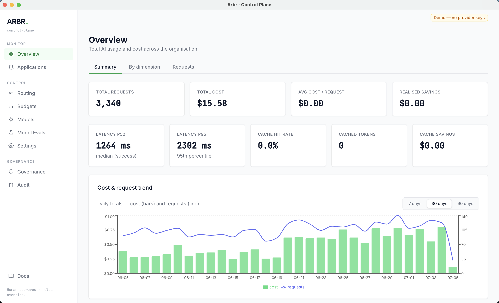

<p align="center">
  <picture>
    <source media="(prefers-color-scheme: dark)" srcset="assets/brand/arbr-wordmark-dark.svg">
    <source media="(prefers-color-scheme: light)" srcset="assets/brand/arbr-wordmark.svg">
    
  </picture>
</p>

<h1 align="center">Arbr Control Plane</h1>

<p align="center">
  <a href="https://www.npmjs.com/package/arbr-client"></a>
  <a href="https://pypi.org/project/arbr-client/"></a>
  <a href="https://www.npmjs.com/package/arbr-audit"></a>
  <a href="LICENSE"></a>
  <a href="package.json"></a>
  <a href="assets/brand/BRAND.md"></a>
</p>

<p align="center">
  <a href="#quickstart">Quickstart</a> ·
  <a href="#where-arbr-fits">Why Arbr</a> ·
  <a href="clients/cli">Try the CLI</a> ·
  <a href="docs/quickstart.md">Docs</a> ·
  <a href="ROADMAP.md">Roadmap</a>
</p>

<p align="center"><strong>Prove it. Approve it. Verify it held.</strong></p>

Arbr is a self-hosted **model optimisation and governance control plane** for teams with
AI traffic in production. It turns request-level cost and performance data into concrete
model-switching opportunities, evaluates candidate models against representative traffic,
and makes every routing change explicit, reversible, and measurable.

Arbr can run as a standalone OpenAI-compatible gateway or in front of infrastructure you
already use, including LiteLLM. Provider connectivity is the foundation; the product is the
evidence-backed loop from opportunity to verified outcome.

## The optimisation lifecycle

1. **Observe real workloads** — attribute cost, latency, model choice, and outcomes by
   application, workflow, team, task type, and user.
2. **Discover opportunities** — surface expensive models handling work that may be served
   by a cheaper candidate, with projected savings based on actual traffic.
3. **Build evidence** — turn representative requests into a controlled evaluation dataset,
   with PII masking and retention controls.
4. **Evaluate candidates** — compare quality, cost, latency, format adherence, and critical
   failures before production routing changes.
5. **Approve and roll out** — a human accepts the recommendation, then uses reversible rules,
   shadow evaluation, or a guarded canary rather than an opaque automatic switch.
6. **Verify the outcome** — record requested and served models on every call so realised
   savings and regressions are measured after rollout, with rollback always available.

**The operating boundary:** a developer's explicitly pinned model is honored as-is. When an
application defers with `model: "auto"`, Arbr follows only the rules and policies a human has
enabled. Budgets can separately alert, downgrade, or block spend at a configured cap.



---

## Where Arbr fits

If you only need a reliable multi-provider proxy, LiteLLM or a managed gateway may already
be the right answer. Arbr is for the next question:

> Which workloads can safely move to a different model, what evidence supports the change,
> and did the rollout deliver the expected result?

- **With LiteLLM:** keep LiteLLM's provider breadth and place Arbr above it for workload
  analysis, recommendations, evaluation gates, approvals, and measured optimisation
  (see [LiteLLM Proxy](docs/providers/litellm.md) to connect one).
- **Standalone:** use Arbr's native and OpenAI-compatible endpoints when one self-hosted
  deployment for gateway, governance, evaluation, and routing is the simpler architecture.
- **Human-governed by design:** recommendations remain advisory until accepted; pinned
  models remain pinned; routing rules and experiments are auditable and reversible.
- **Realised, not promised, savings:** Arbr records both requested and served models, so the
  post-rollout result can be compared with the original baseline.

---

## Packages

The control plane below is the full product. These are published, independently
installable pieces — no Docker or MongoDB required for any of them:

| Package | Install | What it's for |
|---|---|---|
| [`arbr-client`](clients/js) — npm | `npm install arbr-client` | JS/TS gateway client: retries, timeouts, typed errors, a LangChain adapter |
| [`arbr-client`](clients/python) — PyPI | `pip install arbr-client` | Same, for Python ≥ 3.11 |
| [`arbr-audit`](clients/cli) — npm | `npx arbr-audit audit --demo` | Standalone CLI: audit a request log for premium-model overuse, or `wrap` a coding agent live for session cost — zero server, zero database, zero signup |

The two `arbr-client` packages talk to a *running* Arbr gateway. `arbr-audit` doesn't
need one at all — it's the fastest way to see Arbr's actual recommendation logic
against your own data or a live coding-agent session before standing up the full
control plane.

---

## Quickstart

Zero API keys are required to explore — the app ships with a **demo mode** that seeds
realistic data so every dashboard, the recommendation engine, and the routing controls
work out of the box. Adding a provider key unlocks live gateway calls.

### Option A — Docker (one command)

```sh
git clone https://github.com/project-arbr/arbr-control-plane.git && cd arbr-control-plane
cp .env.example .env          # ready to run; no keys needed for the demo
docker compose up             # Mongo + seeded app, dashboard at http://localhost:4100
```

Open **http://localhost:4100** and follow the demo lifecycle:

1. Inspect workload cost and model usage on **Overview**.
2. Open **Recommendations → Recompute** to discover an optimisation opportunity.
3. Inspect its projected savings and evidence requirements.
4. Open the seeded **"classification on gpt-4o"** recommendation — it's already past
   approval, with a guarded canary live in production, no provider key required.
5. Run `npm run demo:seed` (inside the container: `docker compose exec app npm run demo:seed`)
   to seed a second canary that's already breaching its guardrails, then roll it back —
   either by clicking **Roll back**, or by waiting for the auto-rollback monitor to catch it
   itself. `npm run demo:reset` removes only this seeded data, never real data.
6. Add a provider on the **Models** page when you are ready to run a live candidate
   evaluation against your own traffic.

### Option B — Local (Node + your own MongoDB)

```sh
npm run setup     # installs deps, seeds synthetic request records
npm run dev       # server (:4100) + Vite dashboard (:5173)
```

Open **http://localhost:5173**. (Requires a MongoDB reachable at `MONGO_URI`; the default
is `mongodb://localhost:27017/arbr-control-plane`.)

`npm run setup` installs dependencies and runs `seed` (synthetic request records). The
model registry is populated separately: on first server boot, if the registry is empty,
Arbr automatically syncs the full model catalog from LiteLLM — no seed script involved.
See [Model registry](#model-registry) below.

---

## Adding provider keys

Two ways, and you can mix them:

- **Dashboard** — open the **Models** page, paste a key on the provider's card, and the
  provider goes live immediately (no restart). Keys are stored **encrypted at rest**, shown
  only masked, and never returned to the browser. Set `ARBR_ENCRYPTION_KEY` so they're
  encrypted under your own secret (a dev fallback is used otherwise, with a warning).
- **Environment** — set `OPENAI_API_KEY` / `ANTHROPIC_API_KEY` / `GEMINI_API_KEY` in `.env`
  (or your secrets manager). **Env vars take precedence** over dashboard-stored keys — the
  recommended path for production.

## Using the gateway

Point any application at one of two endpoints instead of a provider SDK directly.
Make sure at least one provider is live (dashboard or `.env`).

**Official client packages** — zero-dependency, with retries/timeouts/typed errors and LangChain adapters:

```sh
npm install arbr-client        # JavaScript / Node ≥ 18
pip install arbr-client        # Python ≥ 3.11
```

[](https://www.npmjs.com/package/arbr-client)

Full API reference: [`clients/js`](clients/js) · [`clients/python`](clients/python)

### Arbr native endpoint (`POST /v1/chat`)

Full Arbr features: attribution, task classification, routing rules, budgets, caching.

```sh
curl -X POST http://localhost:4100/v1/chat \
  -H 'Content-Type: application/json' \
  -d '{
    "application": "support-chat",
    "workflow": "ticket-triage",
    "department": "Support",
    "userId": "u-123",
    "taskType": "classification",
    "provider": "anthropic",
    "model": "claude-haiku-4-5",
    "messages": [{ "role": "user", "content": "Classify: my card was declined." }]
  }'
```

Response fields: `model` (served), `modelRequested`, `routingDecision`
(`explicit` | `passthrough` | `rule` | `auto` | `ai` | `cache` | `fallback` | `budget` |
`canary` | `external`), `classifiedBy`, `cacheHit`, and token `usage` (including
`cachedReadTokens` / `cacheWriteTokens` when the provider reported prompt-cache usage).
Every call is logged to MongoDB as a **RequestRecord**.

`taskType`, `model`, and `provider` are all optional. Omitting `model` (or sending
`"auto"`) defers to the router.

### OpenAI-compatible endpoint (`POST /v1/chat/completions`)

Drop-in replacement for the OpenAI chat API. Any client that speaks the OpenAI spec —
LibreChat, OpenWebUI, LangChain's `ChatOpenAI`, the official `openai` SDK — works without
modification. Just change the base URL.

```sh
# Non-streaming
curl -X POST http://localhost:4100/v1/chat/completions \
  -H 'Content-Type: application/json' \
  -d '{
    "model": "claude-haiku-4-5",
    "messages": [{ "role": "user", "content": "Hello" }],
    "max_tokens": 200
  }'
```

Response is a standard `chat.completion` object:

```json
{
  "id": "chatcmpl-...",
  "object": "chat.completion",
  "model": "claude-haiku-4-5",
  "choices": [{ "index": 0, "message": { "role": "assistant", "content": "Hi!" }, "finish_reason": "stop" }],
  "usage": { "prompt_tokens": 10, "completion_tokens": 3, "total_tokens": 13 }
}
```

**SSE streaming** — add `"stream": true` and consume server-sent events:

```sh
curl -N -X POST http://localhost:4100/v1/chat/completions \
  -H 'Content-Type: application/json' \
  -d '{ "model": "gpt-4o-mini", "messages": [{ "role": "user", "content": "Count to 5" }], "stream": true }'
```

Each chunk is a `data:` line in the standard format:
```
data: {"id":"chatcmpl-...","object":"chat.completion.chunk","model":"gpt-4o-mini","choices":[{"index":0,"delta":{"content":"1"},"finish_reason":null}]}

data: [DONE]
```

**Using with the OpenAI Python SDK:**
```python
from openai import OpenAI
client = OpenAI(base_url="http://localhost:4100/v1", api_key="none")

# Non-streaming
response = client.chat.completions.create(model="gemini-2.5-flash", messages=[{"role":"user","content":"Hi"}])

# Streaming
for chunk in client.chat.completions.create(model="gpt-4o-mini", messages=[{"role":"user","content":"Hi"}], stream=True):
    print(chunk.choices[0].delta.content or "", end="", flush=True)
```

Same routing rules, budgets, and logging apply to both endpoints.

---

## LiteLLM and other proxy providers

Arbr doesn't replace your existing LiteLLM proxy — it sits **in front of it** and adds
observability, routing, and governance. Configure LiteLLM as an OpenAI-compatible provider
in Arbr and route requests to it like any other:

**1. Register LiteLLM in Arbr on the Models page**

Add it as an OpenAI-compatible provider. In your `.env` (or dashboard):

```env
# point the OpenAI provider at your LiteLLM instance
OPENAI_API_KEY=your-litellm-api-key
OPENAI_BASE_URL=http://localhost:8000   # or wherever LiteLLM is running
```

Or use a stored credential pointing `baseURL` at your LiteLLM instance.

**2. Route any LiteLLM model ID with pass-through**

Arbr routes to any model ID you send, even if it's not in the registry. Just include
`provider: "openai"` (your LiteLLM-via-OpenAI connection) and the exact model string
LiteLLM understands:

```sh
curl -X POST http://localhost:4100/v1/chat \
  -H 'Content-Type: application/json' \
  -d '{
    "provider": "openai",
    "model": "bedrock/anthropic.claude-3-5-sonnet-20241022-v2:0",
    "messages": [{ "role": "user", "content": "Hello" }]
  }'
```

Arbr routes the request, logs the call, and records `totalCost: 0` until you add a
pricing entry for that model. Add the entry on the **Models** page to get accurate
cost tracking and recommendations.

**3. Streaming through the full chain**

`POST /v1/chat/completions` with `stream: true` streams token-by-token through the full
chain — Application → Arbr → LiteLLM → Bedrock — with no extra config:

```sh
curl -N -X POST http://localhost:4100/v1/chat/completions \
  -H 'Content-Type: application/json' \
  -d '{
    "provider": "openai",
    "model": "bedrock/anthropic.claude-3-5-sonnet-20241022-v2:0",
    "messages": [{ "role": "user", "content": "Tell me a joke" }],
    "stream": true
  }'
```

Or using the OpenAI Python SDK pointed at Arbr:

```python
from openai import OpenAI
client = OpenAI(base_url="http://localhost:4100/v1", api_key="ab_…")

stream = client.chat.completions.create(
    model="bedrock/anthropic.claude-3-5-sonnet-20241022-v2:0",
    messages=[{"role": "user", "content": "Tell me a joke"}],
    extra_body={"provider": "openai"},   # pin to the LiteLLM-backed provider
    stream=True,
)
for chunk in stream:
    print(chunk.choices[0].delta.content or "", end="", flush=True)
```

Arbr forwards the request to LiteLLM using LangChain's streaming API; LiteLLM streams
from Bedrock and Arbr pipes each SSE chunk straight through to the caller. Every token
arrives in real-time with no intermediate buffering.

**4. Use the OpenAI-compat endpoint for a drop-in swap**

If your chat UI (LibreChat, OpenWebUI, etc.) already points at LiteLLM, redirect it at
Arbr's `POST /v1/chat/completions` instead — you get full Arbr observability on every
message with zero change to the UI config beyond the base URL.

---

## Model registry

The model registry is a MongoDB-backed table (`ModelEntry` collection) that maps model IDs
to pricing (USD / 1M tokens) and tier. It replaces the hardcoded `pricing/table.js` from
earlier versions.

### What the registry drives

| Feature | With pricing entry | Without (pass-through) |
|---|---|---|
| Cost tracking | ✅ per call | `totalCost: 0` |
| Recommendations | ✅ (premium overuse flagged) | ✅ partially (known models only) |
| Guardrail downgrade | ✅ | ✅ (if target model is registered) |
| Routing / gateway | ✅ | ✅ (pass-through always works) |

You can route to **any model on any live provider** without a registry entry. Entries
are only needed for accurate cost tracking and tier-aware recommendations.

### Catalog sync (LiteLLM is the source of truth)

There is no static model seed. On a fresh install, when the registry is empty, Arbr
automatically runs a one-time sync against LiteLLM's public model catalog
(`server/src/litellm/sync.js`) at boot, so the registry isn't empty on first use. On an
existing install, any legacy `builtIn: true` entries are converted to `builtIn: false` so
future syncs can manage them the same way as discovered models.

To refresh the catalog later — pull in new models, update pricing/context windows on
existing ones, and drop stale entries — click **Sync Models** on the dashboard's Models
page (calls `POST /api/benchmarks/sync`, which runs LiteLLM pricing sync plus the
LiveBench and LMSYS benchmark-score syncs in one pass), or call LiteLLM sync alone:

```sh
# LiteLLM catalog + pricing only
curl -X POST http://localhost:4100/api/litellm/sync

# Same as the dashboard's "Sync Models" button — LiteLLM + LiveBench + LMSYS
curl -X POST http://localhost:4100/api/benchmarks/sync
```

A sync never touches `tier`, `label`, `builtIn`, or `enabled` — once you've set those,
they're yours. See [ARCHITECTURE.md](ARCHITECTURE.md) for details on the benchmark syncs.

### Adding a new model

**Option A — Dashboard (Models page)**

Open a provider's card on the **Models** page, click **"+ Add model"**, and fill in:
- **Model ID** — the exact string sent in `"model":` in API requests
- **Display name** (required) — human-readable label
- **Tier** — `light` / `mid` / `premium` (drives guardrail and recommendations)

There's no separate provider field (the model is added under the provider card you're
already on) and no manual pricing fields — if the Model ID matches an existing registry
entry, pricing and metadata auto-fill from it; otherwise pricing defaults to $0 and can be
corrected afterward via the API below or the pencil-icon edit form (which does expose
Input $/1M and Output $/1M).

Built-in models cannot be deleted (disable them with the toggle instead); custom models
can be removed.

**Option B — Admin API**

```sh
# Create
curl -X POST http://localhost:4100/api/models \
  -H 'Content-Type: application/json' \
  -d '{ "id": "my-model", "provider": "openai", "label": "My Model", "tier": "mid", "inputPer1M": 1.5, "outputPer1M": 6.0 }'

# Update pricing
curl -X PATCH http://localhost:4100/api/models/my-model \
  -H 'Content-Type: application/json' \
  -d '{ "inputPer1M": 1.2, "outputPer1M": 4.8 }'

# Soft-delete (custom models only; built-ins: use enabled=false instead)
curl -X DELETE http://localhost:4100/api/models/my-model
```

Each write is reflected immediately — the in-memory cache reloads after every mutation,
so the next request uses the updated pricing with no restart.

---

## How it works

```
Applications ─▶ POST /v1/chat              ─▶ ingress ─▶ match ─▶ invoke ─▶ return
               POST /v1/chat/completions        │          │         │
               (OpenAI-compatible, SSE)         │          │         └─ provider call (+ fallback)
                                                │          └─ pinned model? budget? cache? rule? auto-policy?
                                                └─ auth (API key), validate, capture metadata
                                                                         │
                                       after the response (async): classify · cost · log RequestRecord
```

- **Gateway** — two endpoints (Arbr-native + OpenAI-compat); provider keys held server-side;
  an explicitly pinned, connected model is honored as-is (pass-through even for unknown models);
  `"auto"` defers to the router.
- **Model registry** — MongoDB-backed `ModelEntry` collection; LiteLLM sync is the source of
  truth, running once automatically on a fresh/empty install and on-demand afterward via the
  dashboard's **Sync Models** button; in-memory cache keeps the hot path synchronous. Routing
  works without entries; entries enable cost tracking, tiering, and recommendations.
- **Usage logging** — one `RequestRecord` per call, recording **both the model requested
  and the model served** (so realised savings are measurable), full conversation context
  (`messages` + `responseText`), cache token breakdown, and `routingExplain` (the
  non-derivable "why" behind every routing decision). Unknown-model calls log `totalCost: 0`;
  add a registry entry to get accurate billing.
- **Analytics** — aggregations by application, team, workflow, model, provider, task type,
  and user. Per-user spend and **realised savings** (requests served by a cheaper model than
  requested — re-priced at the requested model's rate) are surfaced on the Overview page.
- **Cache observability** — `cachedReadTokens` / `cacheWriteTokens` captured from provider
  responses; costs billed at provider cache rates (~0.1× for Anthropic, ~0.5× for OpenAI);
  cache hit rate and savings shown on the Overview dashboard.
- **Recommendations** — costed suggestions (e.g. *premium-model overuse* on cheap task
  types) with projected savings. Advisory until a human accepts.
- **Controlled routing** — human rules first; then the automated mode a human enabled:
  the heuristic **cost guardrail** or the **AI routing policy** (editable AI-generated
  task→model map, with AI per-call task classification, **difficulty-aware** — easy
  instances of a task route to a cheaper model within the tier, hard instances to a
  stronger one). Plus response caching for exact duplicates and provider fallback.
- **Governance** — per-application **gateway API keys** (trusted attribution + rate limits)
  and **budgets** that alert, downgrade, or block when a scope breaches its cap.

### RequestRecord shape

`requestId, timestamp, application, workflow, userId, department, provider, model,
modelRequested, taskType, classifiedBy, promptTokens, completionTokens, totalTokens,
cachedReadTokens, cacheWriteTokens, cacheSavingUsd, inputCost, outputCost, totalCost,
latencyMs, status, errorMessage, routingDecision, qualityGate, cacheHit, knownPricing,
difficulty, difficultyScore, confidence, routingExplain, source, externalRequestId,
messages, responseText`

This list covers the fields most relevant to attribution, cost, and routing — the full
schema has ~15 more (see `server/src/models/RequestRecord.js`).

---

## Configuration

All via `.env` (see `.env.example`). Nothing is required to start.

| Variable | Default | Purpose |
|---|---|---|
| `PORT` / `HOST` | `4100` / `0.0.0.0` | Bind address |
| `MONGO_URI` | `mongodb://localhost:27017/arbr-control-plane` | Database |
| `ARBR_ADMIN_KEY` | — (open, dev only) | **Auth for the dashboard/admin API.** Required in production |
| `ARBR_ENCRYPTION_KEY` | dev fallback | Encrypts dashboard-stored provider keys. Required in production |
| `OPENAI_API_KEY` / `ANTHROPIC_API_KEY` / `GEMINI_API_KEY` / `AWS_*` / `DEEPSEEK_API_KEY` / `MOONSHOT_API_KEY` / `XAI_API_KEY` / `GROQ_API_KEY` | — | Optional; enable live calls |
| `DEFAULT_PROVIDER` | first live | Initial default-provider preference (runtime-selectable in Settings) |
| `ARBR_DEFAULT_MAX_TOKENS` | `4096` | Default `max_tokens` when the caller omits it. Capped by the model's own output ceiling. |
| `SEED_ON_BOOT` | `false`¹ | Docker only: load demo data on start (**wipes request records**) |
| `CORS_ORIGIN` | `http://localhost:5173` | Allowed dashboard origin (local dev) |

¹ Bare-metal/no-compose default is `false`. The demo `docker-compose.yml` used in the
Quickstart above overrides this to `true` (`SEED_ON_BOOT: ${SEED_ON_BOOT:-true}`) so the
one-command demo has data immediately; `docker-compose.prod.yml` and the GCP overlays force
it back to `false`.

Runtime settings (routing mode, Require-API-keys, budgets, gateway API keys, default
provider/model) are managed in the dashboard and stored in MongoDB.

---

## Authentication

Two credentials, two planes (full details in [DEPLOYMENT.md](DEPLOYMENT.md)):

- **Gateway API keys** (`ab_…`, Settings → API keys) authenticate applications calling
  `POST /v1/chat`, bind attribution to an application, and can carry per-key rate limits.
  Flip **Require API keys** on once every app has one.
- **Admin key** (`ARBR_ADMIN_KEY`) gates the dashboard and the entire admin API. Unset
  (local dev) the dashboard is open and the boot log warns.

For more than one operator, `ARBR_ADMIN_KEY` alone doesn't give individual revocation or
per-user audit attribution. Set `ARBR_AUTH_MODE=oidc` (any OIDC provider — Okta, Auth0, Google
Workspace, Keycloak, ...) or `trusted-header` (GCP IAP or a reverse proxy) to add real
per-user identity: viewer/operator/administrator roles, a **Users** page to manage individual
access, and an audit log that names the actual person behind every change. The admin key keeps
working alongside either mode as a break-glass credential for automation. See
[Accountable admin access](docs/auth.md) for setup.

---

## Production deployment

See **[DEPLOYMENT.md](DEPLOYMENT.md)** — the org model is one standalone instance (like a
LiteLLM proxy or shared MLflow tracking server): single VM with Docker Compose, nginx or an
AWS ALB terminating TLS in front of port 4100, admin key + gateway keys on, `SEED_ON_BOOT=false`,
and a production checklist.

---

## Project layout

```
control-plane/
├── server/src/
│   ├── gateway/
│   │   ├── handler.js          Arbr-native request lifecycle (POST /v1/chat)
│   │   └── openaiCompat.js     OpenAI-compat endpoint (POST /v1/chat/completions, SSE)
│   ├── providers/llm-router/   vendored provider abstraction (+ Anthropic, generic OpenAI-compat)
│   ├── providers/router.js     builds the router from configured providers
│   ├── pricing/
│   │   ├── registry.js         DB-backed model registry with in-memory sync cache
│   │   └── table.js            legacy hardcoded table (kept; registry is source of truth)
│   ├── models/
│   │   ├── ModelEntry.js       Mongoose schema for the model registry
│   │   └── ...                 RequestRecord, Rule, Cap, ApiKey, etc.
│   ├── seed/
│   │   └── seed.js             synthetic RequestRecord data for demo mode
│   ├── litellm/sync.js         LiteLLM catalog sync; source of truth for the model registry
│   ├── classify/classifier.js  manual-first, keyword auto-classify
│   ├── logging/logger.js       writes RequestRecords (zero-cost path for unknown models)
│   ├── routing/                ruleEngine · autoRouter · aiPolicy · capEngine · cache
│   ├── analytics/aggregate.js  dashboard aggregations
│   ├── recommend/engine.js     premium-overuse recommendation
│   ├── api/routes.js           dashboard / admin API (incl. /api/models CRUD)
│   └── index.js                boot: mongoose → registry.init() → express
└── web/                        React + Vite + Tailwind dashboard
                                Models page: add / edit / delete model entries
```

This service is **standalone**. The provider router is vendored under
`server/src/providers/llm-router/`, so the folder can be lifted into its own repo as-is.

---

## Not yet (by design or on the roadmap)

Arbr deliberately acts only where a human makes the call, so a few things are intentionally
absent today:

- **Autonomous rerouting without approval.** The cost guardrail and AI policy take effect
  only after a human enables them; nothing reroutes silently.
- **ML/embedding-based routing and output-quality scoring.** Routing uses task type and a
  difficulty signal, not a learned model of answer quality.
- **PII-aware routing.** Prompts and responses are masked in logs
  (`server/src/logging/piiFilter.js`), but PII is not yet used as a routing signal.
- **Fully autonomous rollout.** Offline replay, shadow evaluation, and canary rollout are all
  built and gate every routing change on real evidence — but the result is always surfaced to
  a human to accept, promote, or roll back. Arbr will never expand or promote a rollout by
  itself, even when every guardrail stays clean. This is permanent, by design, not a
  to-be-finished feature — see the [optimisation lifecycle](#the-optimisation-lifecycle).

Budgets, gateway API keys, and governance controls that earlier versions listed here as
"deferred" have since shipped; see the **Controlled routing**, **Governance**, and
**Authentication** sections above.

Horizontal scale — running more than one instance behind a load balancer — has also since
shipped; see [Running more than one replica](docs/deployment-gcp.md#running-more-than-one-replica).
Budget/rate-limit enforcement is Mongo-backed and correct across replicas; the response caches
and OpenTelemetry span queue are per-process, which the linked section explains. A Helm chart is
still on the [roadmap](ROADMAP.md) — today's path is the docker-compose overlay linked above.

---

## License

MIT — see [LICENSE](./LICENSE).
